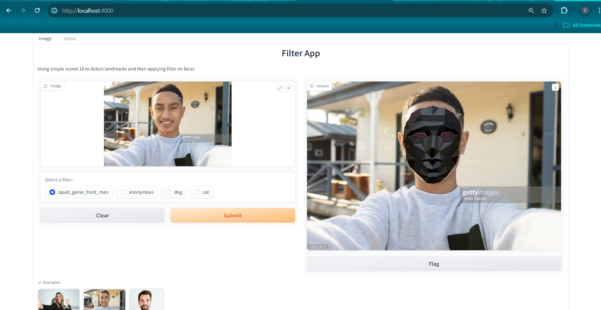

<div align="center">

# Filter

</div>

## Description

In filter project, I am developing an application that applies filters to human faces in an image. I used deepface library for face detection, ResNet18 for facial landmarks detection, and then apply filters to the faces using Delaunay triangulation and affine transformation.

In this repository, I implement an application that applies filters to faces using YOLO5Face, ResNet18, along with two algorithms: Delaunay triangulation and affine transformation. Subsequently, I deploy it as a web application using the Gradio library.

## Installation

```bash
# clone project
git clone https://github.com/dxcanh/filter.git
cd filter

# create conda environment
conda create -n myenv python=3.9
conda activate myenv
pip install -r requirements.txt

```

## Pipeline
    
Run application
    
    ```bash
    python -m apply_filter.app
    ```
    
Now, you can access the application at localhost:4000
    
## Results

Below are images of the application interface.

